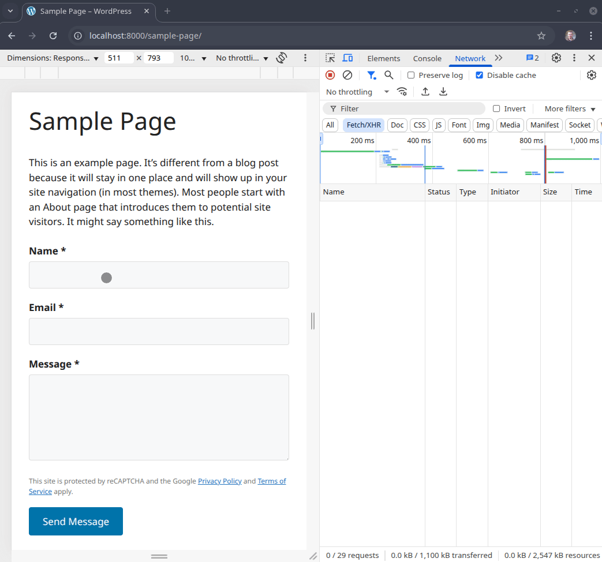

# WordPress AJAX Contact Form with reCAPTCHA v3

This child theme for [GeneratePress](https://generatepress.com/) adds an AJAX-powered contact form protected by Google reCAPTCHA v3.

Demo:



## Features

- Inherits all styles and features from the GeneratePress parent theme.
- AJAX contact form with client-side validation.
- Google reCAPTCHA v3 integration for spam protection.
- Sends email to the WordPress admin email address.
- Includes a shortcode `[simple_contact_form]` for easy embedding.

## Installation

1. **Upload the child theme:**
   - Upload the entire `generatepress-child` folder to your `/wp-content/themes/` directory.

2. **Activate the theme:**
   - In your WordPress dashboard, go to *Appearance / Themes* and activate **GeneratePress Child**.

3. **Set up reCAPTCHA:**
   - Go to [Google reCAPTCHA admin](https://www.google.com/recaptcha/admin) and register your site using **reCAPTCHA v3**.
   - Replace the placeholder keys in `functions.php`:
     ```
     define( 'RECAPTCHA_SITE_KEY', 'your_site_key_here' );
     define( 'RECAPTCHA_SECRET_KEY', 'your_secret_key_here' );
     ```

4. **Place the contact form:**
   - Insert the shortcode `[simple_contact_form]` into any post, page, or widget.

## File Structure

```
generatepress-child/
│
├── functions.php # Registers form, AJAX handler, reCAPTCHA
├── contact-form.js # Handles frontend AJAX and reCAPTCHA token
├── style.css # Child theme styles (optional)
└── README.md # Documentation
```

## How It Works

- Enqueues reCAPTCHA script and *contact-form.js* on single post/page views.
- The form collects name, email, and message fields.
- On submit:
  - reCAPTCHA token is generated using `grecaptcha.execute()`.
  - Form data + token are sent via AJAX to WordPress.
- Handles AJAX request in *functions.php* via `wp_ajax_*` and `wp_ajax_nopriv_*`.
- Validates nonce, input, and reCAPTCHA score.
- If valid, sends the email to the admin and returns a success JSON response.

## Customization

- **Email Destination:** By default, emails go to the WordPress admin email. Modify `$to = get_option( 'admin_email' );` if needed.
- **Form Fields:** You can edit the form markup inside the `simple_contact_form_shortcode()` function.
- **Style:** Add your custom styles to `style.css` or enqueue additional CSS.

## Security Notes

- All inputs are sanitized using WordPress functions.
- Nonce verification protects against CSRF.
- reCAPTCHA v3 verifies human interaction before sending the email.

## Troubleshooting

- Ensure you have a valid SMTP configuration if emails are not being sent.
- Check the browser console and WordPress logs for any reCAPTCHA or AJAX errors.
- Use a plugin like **WP Mail Logging** to confirm email delivery.

## License

This child theme is open for modification and redistribution. Attribution appreciated.

## Credits

- [GeneratePress Theme](https://generatepress.com/)
- [Google reCAPTCHA](https://www.google.com/recaptcha/)
